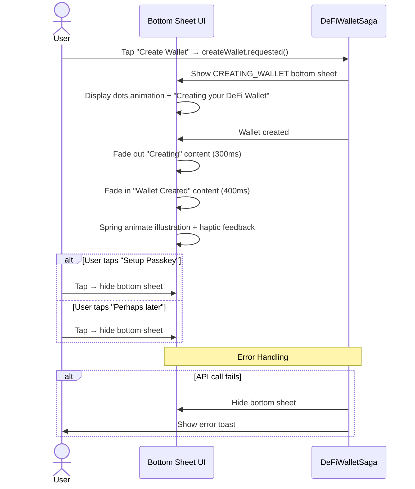
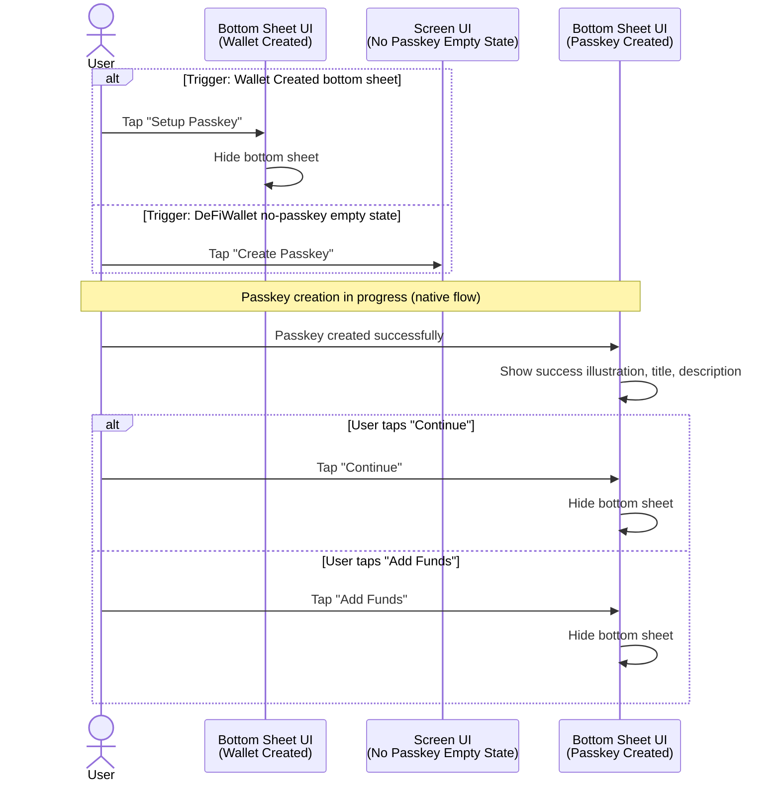
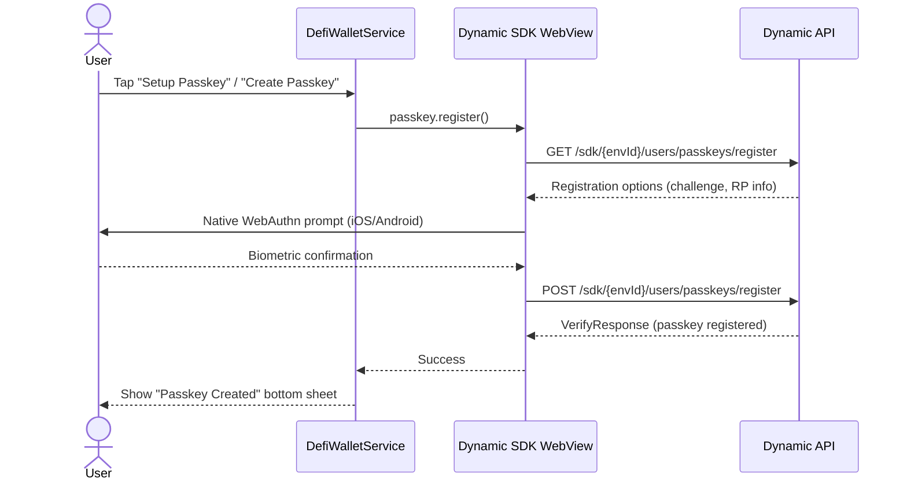
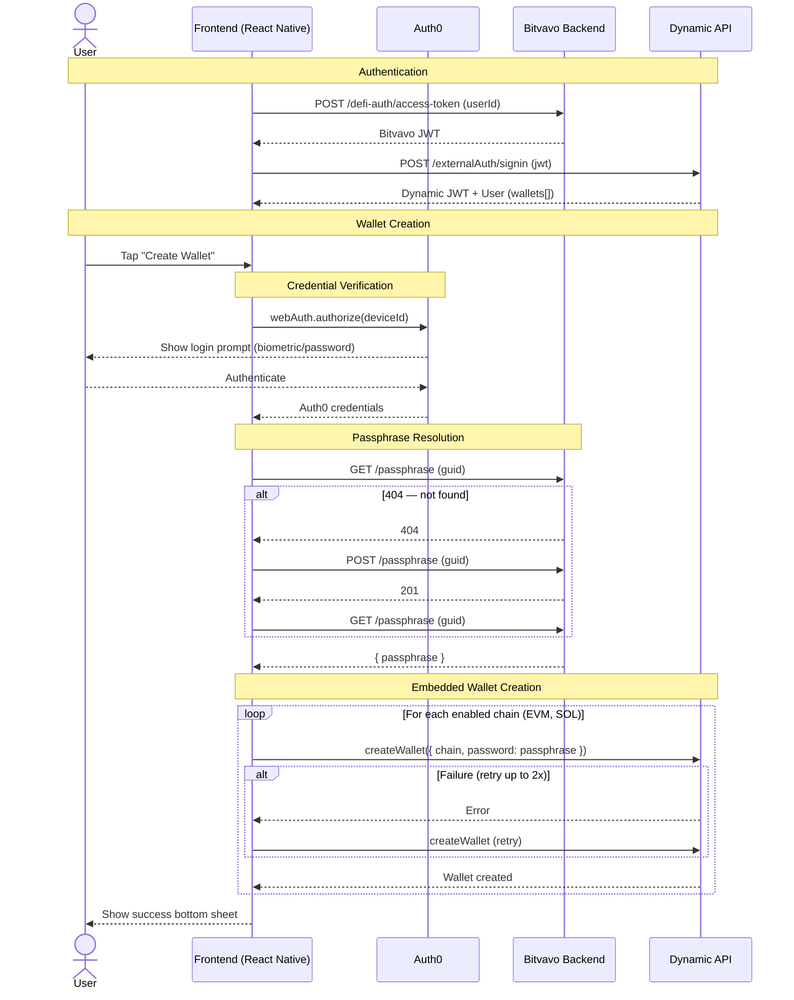

# Sequence Diagram Examples

Real examples from the project, organized by type and complexity.

## UI Diagrams

### Simple — Single bottom sheet with user choices

### Medium — Multiple UI surfaces with entry points

## Service Diagrams

### Simple — Single external SDK (3-4 participants)

Best for flows that touch one external system.

### Complex — Multiple external systems (4-5 participants)

Best for flows that span multiple backends, SDKs, or auth providers.

## Choosing Between Simple and Complex

| Signal | Use Simple (3-4 participants) | Use Complex (4-5 participants) |
|--------|-------------------------------|--------------------------------|
| External systems | 1 SDK/API | 2+ SDKs/APIs |
| Auth involved | No separate auth step | Auth0, JWT exchange, etc. |
| Retry/branching | Minimal | Multiple conditional paths |
| Diagram length | ~15 lines | ~25 lines max |
